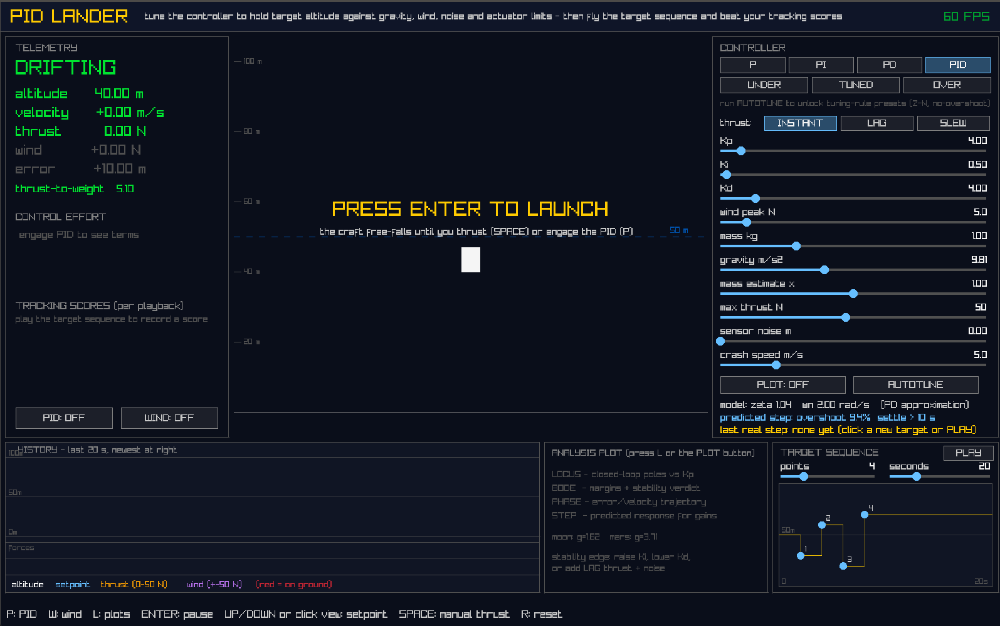

---
# pid-lander - A Control Theory Flight Console in C

## Project Overview & Scope

***pid-lander*** is a real-time control engineering sandbox: a 1-D lunar lander whose thrust is governed by a PID controller that the user designs, tunes, breaks, and analyses live. The craft fights gravity, randomised wind gusts, sensor noise, and actuator limitations while the player commands target altitudes - either directly, or by drawing a stepped altitude-vs-time mission profile and playing it back for a quantified tracking score.

The deliberate constraint that makes the problem interesting is that **the actuator is one-sided**: thrust can only push up (`u ≥ 0`). The controller's only downward authority is gravity itself, so descending means cutting thrust entirely and waiting - overshoot is punished slowly, saturation is routine, and naive textbook PID visibly fails. Every "extra" in this project exists to expose, measure, or fix a real consequence of that constraint.

The project is written in C99 against [raylib](https://www.raylib.com/) for rendering, structured as ten small modules (plant, controller, instruments, analysis plots, autotuner, UI widgets) with a headless test suite and an autonomous self-test mode that regression-checks the instrumentation itself.


<span style="font-size: 14px">Figure 1; The full flight console: telemetry and per-term control effort (left), flight view with wind streaks (center), controller design panel (right), 20-second history strips, analysis plot, and mission sequence editor (bottom).</span>




<span style="font-size: 14px">Figure 2; Brief sample of gameplay. Game is started with button press and manually controlled by user-presses on spacebar by default. PID control can be started by pressing 'P'. Control gain bars and telemtry are at left, history plot of altitude, wind force, thrust and altitude set at bottom. Toggle panel at right sets controls.</span>

 


<span style="font-size: 14px">Figure 3; Changing plots between bode, phase, root locus and step response</span>


<span style="font-size: 14px">Figure 4; Adjusting flight sequence, number of altitudes, timespan and altitude setting. Errors and effort are logged for plays on each sequence. Control weights can be adjusted and tested against known sequence.</span>

<!-- <a href="https://youtu.be/yYE1kUrhGyA" target="_blank">
  
</a>
 -->


<br>
<span style="font-size: 14px">Figure 5; Youtube vide of sample playing the sequence. Craft is landed successfully as displayed with m/s landing speed. Sequence can be rerun with different parameters.</span>

## The Plant: Physics & Real-Time Architecture

The craft is a rigid body on a vertical axis with linear drag and a disturbance force:

```
m·y'' = u − m·g − c·y' + w(t)        u ∈ [0, u_max]
```

Physics runs at a **fixed 120 Hz timestep, decoupled from the render rate** by an accumulator loop with a clamped frame time - the standard pattern for deterministic real-time simulation. Integration is **semi-implicit Euler** (velocity first, then position with the *new* velocity), chosen because plain explicit Euler slowly injects energy into oscillating systems, which would corrupt exactly the marginal-stability experiments this sandbox exists to run.

```c
// One fixed physics step: semi-implicit Euler (velocity first, then position).
float a = (s->u - m * g - DRAG * s->v + s->wind) / m;
s->v += a * dt;
s->y += s->v * dt;    // position advances with the NEW velocity
```

The plant is fully live: mass, gravity, maximum thrust, sensor noise, and the actuator's dynamic response - **INSTANT**, first-order **LAG** (τ = 0.2 s), or rate-limited **SLEW** - are all sliders, so the controller can be watched coping with a plant that changes underneath it. Wind gusts are smooth `(1−cos)/2` force pulses with randomised timing, amplitude, and direction, so disturbances ramp realistically instead of stepping.

## The Controller: From Textbook PID to an Honest One

The control law is the classical `u = Kp·e + Ki·∫e·dt + Kd·de/dt`, but a direct implementation of that equation flies badly, and the project quantifies exactly *how* badly before fixing it. Four upgrades - each a standard industrial practice - turn the textbook controller into an honest one:

1. **Integrator anti-windup** (conditional integration): the integrator freezes whenever the actuator is saturated and the error would push it further into the limit. Without this, a 30 m climb winds up a huge integral during saturation that must then be "unwound" through overshoot.
2. **Derivative on measurement**: the D term differentiates `−y` rather than the error, so setpoint steps no longer spike the actuator (the classic "derivative kick").
3. **Filtered derivative**: a 50 ms first-order low-pass on the derivative term. With the sensor-noise slider up, the unfiltered D term visibly saturates the actuator with noise; the filter is what makes derivative action usable on a real signal.
4. **Gravity feedforward**: the controller outputs `u = u_ff + PID(e)` with `u_ff = m̂·g`, so the PID handles *deviations* only. Critically, the PID's output limits are set to the actuator range *remaining after feedforward*, so anti-windup still sees the true saturation boundary.

```c
// Anti-windup: freeze the integrator when the last output was saturated
// and this error would only push it further into the limit. Ki is folded
// in here so a live Ki change rescales only future accumulation instead
// of stepping the whole term (bumpless tuning).
if (!((pid->sat > 0 && e > 0.0f) || (pid->sat < 0 && e < 0.0f)))
    pid->i_term += pid->ki * e * dt;

// Derivative on measurement (d/dt of -y): immune to setpoint steps.
float d_raw = pid->primed ? -(measurement - pid->prev_meas) / dt : 0.0f;
...
// First-order low-pass; alpha = dt/(tau+dt) is the discrete pole mapping.
pid->d_filt += (d_raw - pid->d_filt) * dt / (pid->tau + dt);
```

The mass estimate is deliberately adjustable (a "model error" slider): set it 10% low and the integral term can be watched quietly absorbing the missing force. The headless test suite confirms the theory: the integrator converges to **0.97 N against a predicted (m−m̂)·g = 0.98 N**.

Measured on a 30 m climb (fixed-step headless test, identical dynamics):

| Metric | Textbook PID | With the four upgrades |
| --- | --- | --- |
| Sag when engaging at hover | 2.12 m | **0.21 m** |
| Overshoot (30 m step) | 15.8 % | **5.2 %** |
| 2 %-settling time | 19.5 s | **13.1 s** |
| Gust rejection (+5 N, 1.5 s pulse) | - | **max 0.77 m deviation, fully recovered** |

> The integrator also gets one subtle upgrade for interactivity: it accumulates `Ki·e·dt` (the term itself) rather than raw `∫e·dt`, so dragging the Ki slider mid-flight rescales only *future* accumulation instead of stepping the output - bumpless live tuning.

## Analysis Instruments: Closing the Loop Between Theory and Simulation

With feedforward cancelling gravity, the closed loop is approximately second-order with

```
ωn = √(Kp/m)          ζ = (Kd + c) / (2·√(Kp·m))
```

and the sandbox is built to *prove* that claim rather than assert it. A PD-only small-step experiment predicts 0 % overshoot and ≈2.9 s settling for ζ = 1.04, ωn = 2.0; the simulation measures **0.0 % overshoot and 3.4 s** - the gap attributable to the 50 ms derivative filter the formula ignores. Running the same step with the integral term enabled produces 9.4 % overshoot, a concrete demonstration that the second-order formula describes PD + feedforward only, and that integral action is precisely what breaks it.

Four live analysis plots share a panel:

* **Root locus** - closed-loop poles of `m·s³ + (c+Kd)·s² + Kp·s + Ki = 0` swept over Kp with the current Ki/Kd held, computed by a Cardano/trigonometric cubic solver (verified to ~1e-12 residuals). Current poles are marked and turn red as they cross into the right half-plane.
* **Bode plot with margins** - open-loop `L(jω) = C·A·G` evaluated in complex arithmetic, *honestly including* the derivative filter and the LAG actuator's phase contribution, with gain/phase margins read off the crossings.
* **Phase portrait** - the error/velocity trajectory spiralling into the origin (or orbiting it, or diverging), a direct visualisation of damping.
* **Predicted step response** - a linear closed-loop simulation for the *current* slider gains, redrawn live, with predicted overshoot and settling time printed next to the *measured* values from the last real step the craft flew. Theory and reality, side by side, updating as you drag sliders.


<span style="font-size: 14px">Root locus and Bode views. The Bode panel prints an exact STABLE/UNSTABLE verdict alongside the advisory margins - see below for why the margins alone were not enough.</span>

### When Phase Margin Lies: Conditional Stability

The Bode implementation surfaced a genuinely instructive trap. For this plant, integral-driven instability appears as a **−180° phase crossing at low frequency where the gain is still above unity** - a *conditionally stable* loop shape where the usual "phase margin positive ⇒ stable" heuristic gives the wrong answer. My first implementation cheerfully reported +14° of phase margin for gain sets that were provably unstable.

The fix was to keep PM/GM as advisory readouts but derive the actual verdict exactly: a **generic Routh-Hurwitz array** evaluated on the full closed-loop characteristic polynomial *including* the derivative filter and actuator lag (5th order):

```
s(1+τf·s)(1+τa·s)(m·s² + c·s) + Kp·s(1+τf·s) + Ki(1+τf·s) + Kd·s² = 0
```

The Routh implementation was validated three ways: against the Cardano pole solver over **2,000 randomised gain sets (0 mismatches)**, against brute-force numerical simulation of the linear loop on 8 hand-picked cases including the conditionally-stable shapes (8/8 agreement), and against the analytic stability boundary `Ki = (c+Kd)·Kp/m`, which the poles cross within one part in a thousand. A satisfying byproduct: the verdict correctly reports that Kp = 30 is stable with an instant actuator but **unstable with the LAG actuator** - the phase-lag destabilisation that motivates margin analysis in the first place.

## Relay Autotuning

The console includes a one-button implementation of the **Åström-Hägglund relay experiment**, the method inside most industrial autotuners. The controller is replaced by a relay with hysteresis (bang-bang thrust around the setpoint), which forces the plant into a controlled limit cycle. After discarding the transient, the oscillation's amplitude `a` and period `Tu` are measured over three cycles, and the describing-function result

```
Ku = 4d / (π·a)
```

recovers the ultimate gain. From the measured (Ku, Tu), three tuning-rule presets unlock: **Ziegler-Nichols PID**, **Z-N PI**, and **Tyreus-Luyben** ("no overshoot") - so one physical experiment yields three competing tunes that can be raced against each other on the mission scoreboard. Because the method is purely observational (it knows nothing about the plant model), it keeps working after the mass and gravity sliders have changed the plant - retune after "flying to the Moon" and it simply measures the new dynamics. The hysteresis band widens automatically with the sensor-noise setting to prevent chatter, and the experiment aborts safely if no steady oscillation develops.

## The Game Layer: Making Tuning Measurable

Control performance is subjective until it is scored. The mission system makes it a game with numbers:

* **Target sequence editor** - up to ten numbered points dragged on a height-vs-time graph define a stepped altitude profile (with an adjustable timeframe); PLAY runs it against sim time with a sweeping cursor.
* **Tracking scores** - every playback records the standard control performance indices: **IAE** (∫|e|dt), **ITAE** (time-weighted, punishing persistent error), maximum error, and **control effort** (Σ|Δu|, total actuator movement). The last four runs stack in a table with the gains that flew them, which makes the classic trade-off tangible: effort can always buy error, and a good tune scores well on both.
* **Landing grading** - every touchdown is graded at the point of impact ("LANDED - 2.3 m/s impact", colour-coded soft/firm), and exceeding the crash-speed threshold destroys the craft in a debris shower. Impact is reported as touchdown *speed* rather than a fictional force figure, because impact force is undefined for a rigid contact - and speed compares directly against the crash threshold.


<span style="font-size: 14px">A mission profile being flown: the gold staircase is the commanded profile, the white trace the flight, and each completed run drops IAE/ITAE/effort scores onto the board for the tune that flew it.</span>

## Challenges & Bugs

### The 20-Second Ghost: A Buffer Overrun Masquerading as a Physics Bug

The best bug of the project looked like corrupted flight data: the altitude trace in the history chart would drop to zero for about two seconds *while the craft was demonstrably flying* - and the segment would reappear with a precise period. The observation that cracked it was that **the recurrence period exactly equalled the chart's 20-second window** - a textbook stale-slot signature in a circular buffer.

The instrumentation to find it was built in three stages, because the first two *exonerated* the obvious suspect:

1. A **headless harness** drove the real ring-buffer module through crashes, resets, frame stalls, and eight wraparounds - 4,883 samples verified perfect. The ring logic was innocent.
2. A **`--selftest` mode** was added to the full application: it flies a sinusoidal profile autonomously while cross-checking the *entire* ring against a shadow copy of every recorded sample, twice per frame. This caught **497,280 mismatches** - the corruption only existed with all modules running together, i.e. a memory stomp from outside the module.
3. A memory dump on first mismatch showed the corrupted altitude values were the *tail of the step-response prediction curve*, and that the prediction buffer sat 16 bytes before the chart in memory.

The root cause was a single float-arithmetic character flaw:

```c
const int n = (int)(STEP_T / dt);        // 10.0f / (1/120.0f) = 1199.9995...
                                         // truncates to 1199, not 1200!
const int sub = n / STEP_N;              // 1199/240 = 4, not 5...
sp->curve[i / sub] = y;                  // ...so the index runs to 299:
                                         // SIXTY floats past the array end
```

Those sixty out-of-bounds writes landed in the first 56 slots of the chart's altitude ring - 56 samples at 30 Hz is the observed ~2 seconds, fixed slots in a circular buffer explain the exact 20-second recurrence, and the prediction curve's settled value of ≈1.0 plotted a hair above the zero line explains "altitude = 0". The fix is rounding instead of truncation plus a hard bounds guard, and the self-test now runs as a permanent regression gate: **0 mismatches, 0 phantom zeros**.

> The lesson that stuck: `-Wall -Wextra` and code review both missed this. What found it was (a) trusting a precise observation about *periodicity* over the assumption that the display must be misread, and (b) building verification layers that could distinguish "module wrong" from "memory stomped from outside".

### Other Fights Worth Recording

* **Windows packaging** - MSYS2's prebuilt raylib static library is itself compiled against a GLFW DLL import (`__imp_glfw*` link errors), so true static linking is off the table without building raylib from source; the build instead stages the two required DLLs beside the executable automatically.
* **Bode phase unwrapping** - `carg()` can report a true −180° as +180°, silently shifting the entire unwrapped phase curve by a full turn and inflating the phase margin by 360°. Pinned by forcing the lowest-frequency sample onto the physically known branch (this plant lags at least −90° at DC).
* **The startup crash nobody sees** - the craft originally spawned in free-fall and hit the ground at 31 m/s while the user was still reading the UI, seeding the history with legitimate-but-baffling zeros. The application now starts paused behind a "PRESS ENTER TO LAUNCH" gate, and the chart marks genuine ground contact in red and resets with a yellow tick, so the flight record is self-explanatory.

## Verification Culture

The repository treats the analysis math with the same suspicion as the flight code. `make test` runs headless suites with no graphics dependency on the control loop:

* closed-loop metric tests pinning the sag/overshoot/settling numbers in the table above, including the analytic-agreement case;
* solver validation (cubic residuals, Routh vs. poles over randomised gains, Routh vs. brute-force linear simulation);
* the ring-buffer integrity harness;

plus `lander --selftest`, the full-application autonomous flight with shadow-verified instrumentation. Every number quoted on this page is reproduced by one of these.

## Learnings

* **Saturation is where control theory gets real.** Anti-windup, feedforward-aware output limits, and the one-sided actuator turned "implements PID" into "understands why PID implementations have all those extra branches".
* **Frequency-domain intuition needs exact backstops.** Margins are indispensable and insufficient; conditional stability taught me to pair every heuristic readout with an exact criterion (Routh) and to validate both against independent methods.
* **Numerical honesty is a habit, not a feature.** A truncated float cost a week of "impossible" symptoms; a rounding rule and a bounds guard cost two lines. The differential is why simulation code deserves test harnesses.
* **Instrumentation pays compound interest.** Every gauge built to *demonstrate* theory (term bars, strip charts, prediction-vs-measurement) ended up being the tool that *debugged* the system.

> Full source - the simulation, controller, analysis plots, autotuner, UI toolkit, and all test harnesses - is available on my [GitHub](https://github.com/OliCar-del/PIDlander).